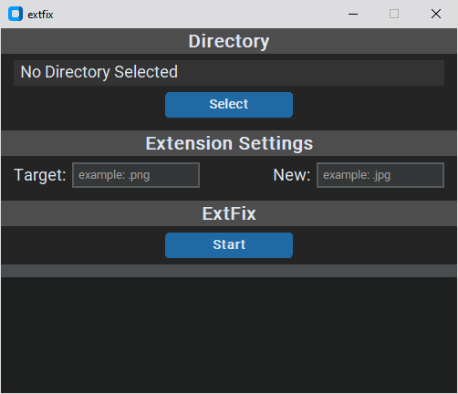
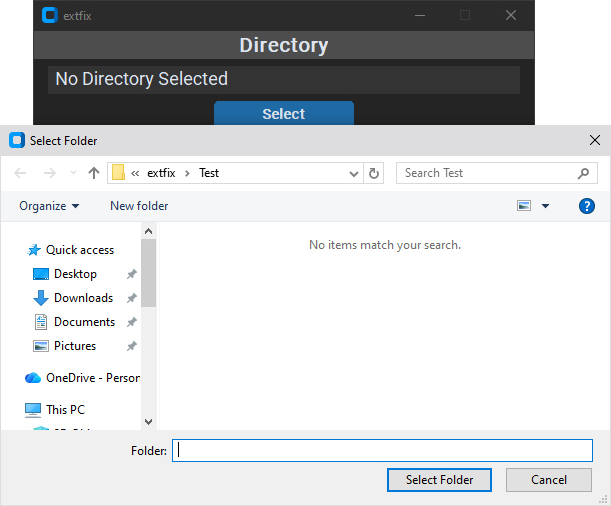
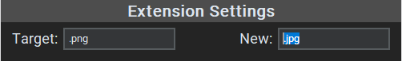
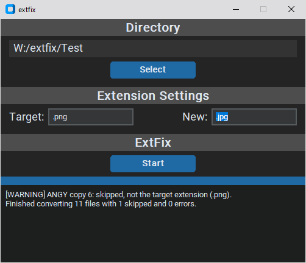
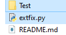

# extfix
Mass fixes or converts file extensions in a specified folder to a different extension.
- i.e. `file.png` -> `file.jpg`

  

# Requirements
- Python >= 3.9
- `pip install -r requirements.txt`
  - Not needed for [extfix_cli](extfix_cli.py) version.

# How To use (GUI - [extfix.py](extfix.py))
1. Download from the [releases](https://github.com/ThomasQTruong/extfix/releases).
2. Open the program.
3. Select the `Target Directory` (the directory with all the files to fix).
    - 
4. Input the `Target Extension` and `New Extension` values.
    - i.e. `.jpg`, `.png`, or something else!
    - 
5. Click start and the file extensions will be fixed!
    - 

# How To Use (Command Line - [extfix_cli](extfix_cli.py))
1. Download [extfix_cli](extfix_cli.py).
2. Edit [extfix_cli](extfix_cli.py) with a text editor.
  - `DIRECTORY_NAME` = The directory path with all the files to be fixed.
    - If you do not know what you are doing, just create a folder in the same directory as [extfix_cli](extfix_cli.py) (but don't put [extfix_cli](extfix_cli.py) in the created folder).
      - Either name the folder `Test` or whatever you set the `DIRECTORY_NAME` to.
    - 
  - `TARGET_EXT` = the extension you want to be replaced.
    - i.e. `file.png` -> `file.jpg` then you would put `.png`.
  - `NEW_EXT` = the new extension to replace with.
    - i.e. `file.png` -> `file.jpg` then you would put `.jpg`.
3. Run [extfix_cli](extfix_cli.py) and it should work!
